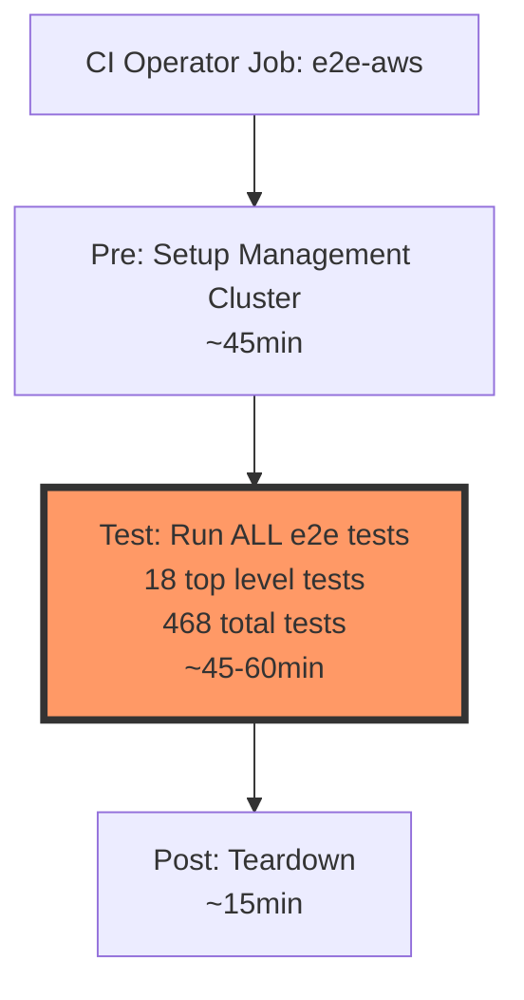
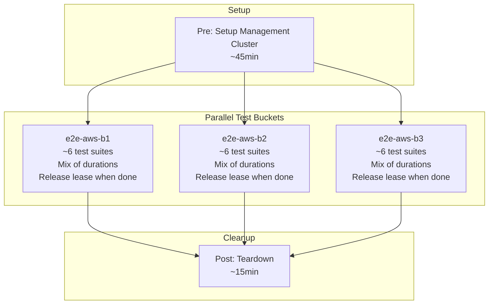
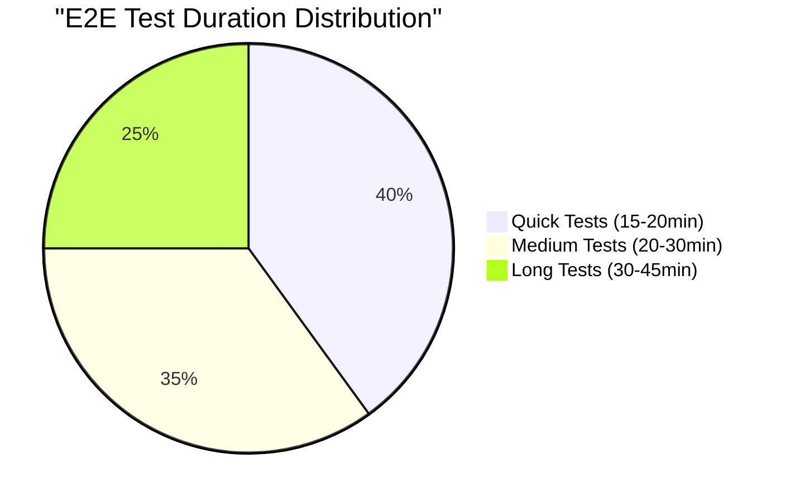
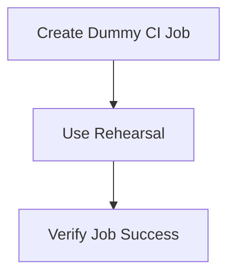
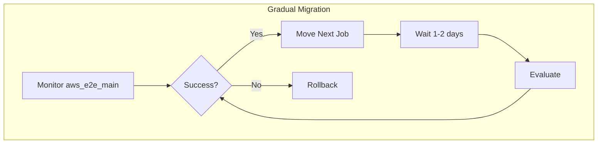
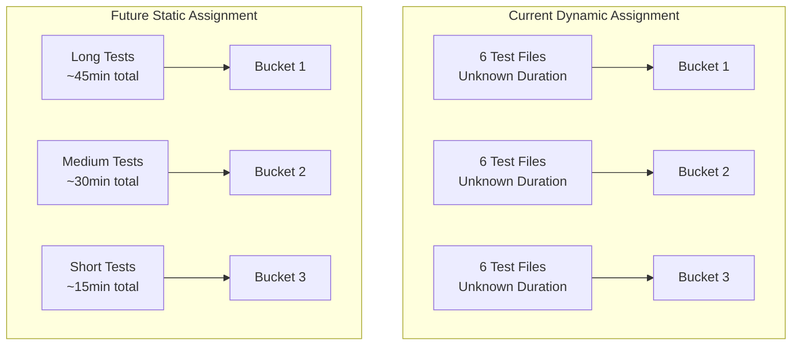

# E2E Test Bucketing Proposal

## Prelude

There are several potential approaches to improve HyperShift's CI stability and efficiency:

1. **Cluster Pools**
   - Pre-provision management clusters
   - Reduce setup/teardown overhead
   - Complex implementation and maintenance

2. **Infrastructure Optimization**
   - Tune instance types and configurations
   - Optimize resource requests/limits
   - Requires extensive testing and validation

3. **Test Suite Refactoring**
   - Reorganize test dependencies
   - Remove redundant validations
   - Long-term, high-effort initiative

This proposal focuses on a low-hanging fruit: test bucketing. By implementing a simple but effective test distribution strategy, we can achieve immediate improvements in resource utilization and retest efficiency, while leaving room for more comprehensive optimizations in the future.

## Current State



### Problems

1. **Single Test Execution Context**
   - 18 top-level test suites (~468 total test cases)
   - Each test suite creates 1 hosted cluster
   - Some test suites take 45+ minutes
   - When a single test fails, entire suite must be rerun
   - Boskos lease blocked for entire duration (~1h 45min)

2. **Resource Inefficiency**
   ```mermaid
   graph LR
       A[Boskos Lease] --> B[Single e2e Job<br/>~1h 45min duration]
       B --> C1[Test Suite 1<br/>45min]
       B --> C2[Test Suite 2<br/>20min]
       B --> C3[Test Suite 3<br/>15min]
       B --> C4[More Suites...]
       
       style C1 fill:#f96,stroke:#333,stroke-width:4px
   ```
   - Single lease holds resources for longest test duration
   - Even quick tests (~15-20min) block lease for full duration
   - Resources underutilized after quick tests complete

## Proposed Solution



### Key Changes

1. **Test Bucketing**
   - 18 test suites split into 3 buckets (~6 suites each)
   - Each bucket completes independently
   - Resources released as soon as bucket completes
   - Long-running tests don't block shorter ones

2. **Resource Optimization**
   ```mermaid
   graph TB
       subgraph "Current Approach"
       A1[PR1 Job Lease<br/>1h 45min] --> B1[All Tests]
       A2[PR2 Job Waiting] --> B2[Blocked]
       end
       
       subgraph "Bucketed Approach"
       C1[PR1 Bucket1<br/>45min] --> D1[Long Tests]
       C2[PR1 Bucket2<br/>20min] --> D2[Medium Tests]
       C3[PR1 Bucket3<br/>15min] --> D3[Short Tests]
       D3 --> E1[PR2 Can Start Here]
       end
   ```
   - Shorter test buckets release resources earlier
   - Other PRs can utilize freed resources sooner
   - More efficient resource utilization

## Advantages

1. **Improved Resource Utilization**
   - Resources released incrementally as buckets complete
   - Faster resource availability for other PRs
   - More efficient Boskos lease usage

2. **Faster Retests**
   - Only failed bucket needs to be rerun
   - Most buckets complete in 15-30 minutes
   - Significant time savings on retests
   - Lower resource waste on retests

3. **Better PR Testing Flow**
   ```mermaid
   graph LR
       subgraph "Current Retest"
       A1[Test Failure] --> B1[Rerun ALL Tests<br/>1h 45min]
       end
       
       subgraph "Bucketed Retest"
       A2[Test Failure] --> B2[Rerun Single Bucket<br/>15-30min]
       end
   ```

## Example Test Distribution



1. **Quick Test Suites (~15-20min)**
   - Configuration validation
   - API testing
   - Basic functionality

2. **Medium Test Suites (~20-30min)**
   - Cluster creation
   - Node operations
   - Platform features

3. **Long Test Suites (~30-45min)**
   - Upgrade testing
   - Scale testing
   - Complex operations

## Implementation Overview

1. **Test Discovery and Bucketing**
   ```mermaid
   graph LR
       A[List _test.go files] --> B[Sort files]
       B --> C[Calculate bucket size]
       C --> D[Assign files to buckets]
       D --> E[Run bucket tests]
   ```

2. **CI Integration**
   ```mermaid
   graph TB
       A[Input YAML] --> B[Parse test blocks]
       B --> C[Generate N copies]
       C --> D[Add bucket env vars]
       D --> E[Output modified YAML]
   ```

### POC Components

1. **Test Bucketing Logic**
   - Located in `test/e2e_exp/`
   - Uses build tags for selective compilation
   - Deterministic file distribution

2. **CI Job Generation**
   - New jobtemplate tool
   - Transforms single job into N bucketed jobs
   - Preserves shared pre/post steps

## Next Steps

### Phase 1: PoC Validation (1 day)

- Add test job with bucketing enabled
- Use rehearsal to validate changes
- Verify tooling and bucket distribution

### Phase 2: Integration (1 day)

- Move bucketing code from e2e_exp to core e2e_test
- Apply bucketing to aws_e2e_main job first
- Keep other jobs unchanged as control group

### Phase 3: Rollout (1-2 weeks)

- Monitor initial bucketed job performance
- If successful, gradually migrate other jobs
- Allow some time for observation between migrations

### Implementation Timeline
| Phase | Duration | Activities |
|-------|----------|------------|
| PoC Validation | 1 day | Dummy job creation and testing |
| Integration | 1 day | Move to core e2e_test package |
| Initial Rollout | 1-2 days | aws_e2e_main migration |


## Future Improvements

### Static Bucket Assignment

The current implementation uses a simple dynamic bucketing strategy that distributes test files equally across buckets. While this provides a basic level of parallelization, we can improve resource utilization through static bucket assignment based on test duration heuristics.



#### Duration-Based Assignment Strategy

1. **Test Duration Collection**
   ```mermaid
   graph LR
       A[CI Jobs] --> B[Test Duration<br/>Metrics Collection]
       B --> C[Duration Database]
       C --> D[Static Bucket<br/>Configuration]
   ```
   - Record test durations across multiple runs
   - Calculate average and variance
   - Identify patterns in resource usage

2. **Test Categories by Duration**
   - **Long-Running Tests (~45 min)**
     - Control plane upgrades
     - Full cluster creation/destroy cycles
     - Complex multi-component tests
   - **Medium Tests (~20-30 min)**
     - NodePool operations
     - Platform-specific features
     - Multi-step validations
   - **Quick Tests (~5-15 min)**
     - API validation
     - Configuration checks
     - Simple component tests

3. **Static Assignment Benefits**
   ```mermaid
   graph TB
       subgraph "Resource Usage Over Time"
           B1[Bucket 1] --> L1[45min]
           B2[Bucket 2] --> L2[30min]
           B3[Bucket 3] --> L3[15min]
           
           L3 --> F1[Resources Free]
           L2 --> F2[Resources Free]
           L1 --> F3[Resources Free]
       end
   ```
   - More predictable bucket durations
   - Better resource planning
   - Earlier resource release for shorter tests
   - Improved CI queue throughput

4. **Implementation Plan**
   - Phase 1: Collect test duration metrics
   - Phase 2: Analyze resource usage patterns
   - Phase 3: Define static bucket assignments
   - Phase 4: Add configuration for manual overrides

#### Configuration Example
```yaml
buckets:
  bucket1:
    name: long-running
    tests:
      - TestUpgradeControlPlane  # ~40min
      - TestNodePool             # ~52min
    expected_duration: "50m"
  
  bucket2:
    name: medium
    tests:
      - TestCreateCluster        # ~36min
      - TestAutoscaling         # ~30min
    expected_duration: "35m"
  
  bucket3:
    name: quick
    tests:
      - TestValidation          # ~15min
      - TestConfiguration       # ~10min
    expected_duration: "15m"
```

This static assignment approach will be implemented after:
1. Collecting sufficient duration data from current dynamic implementation
2. Analyzing resource usage patterns across test runs
3. Identifying stable test duration patterns
4. Developing bucket assignment algorithms