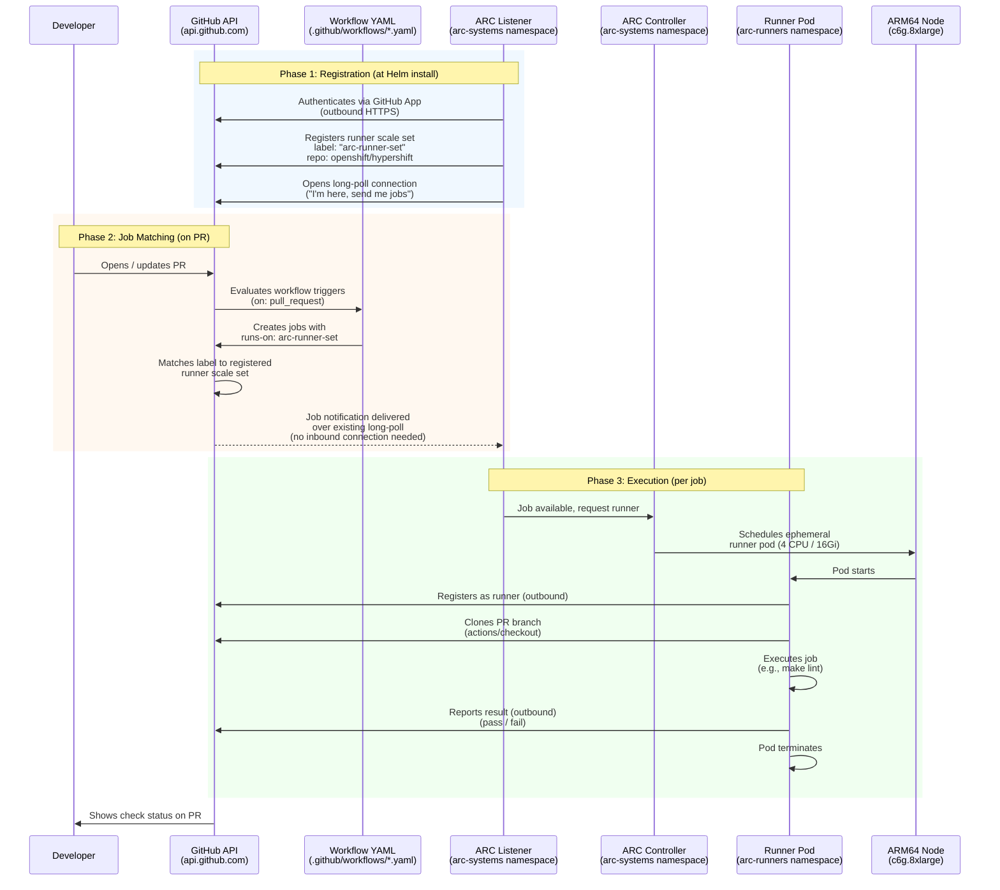

# Self-Hosted GitHub Actions Runners for HyperShift

This directory contains the configuration for self-hosted GitHub Actions runners
deployed on a HyperShift hosted cluster, targeting the `openshift/hypershift` repository.

Related Jira: [CNTRLPLANE-2986](https://redhat.atlassian.net/browse/CNTRLPLANE-2986)

## Architecture Overview

The runners are deployed using [Actions Runner Controller (ARC)](https://github.com/actions/actions-runner-controller)
on an ARM64 (aarch64) HyperShift hosted cluster on AWS. ARC manages ephemeral
runner pods that pick up GitHub Actions jobs and terminate after completion.

### How It Works

When a PR is opened against `openshift/hypershift`, GitHub triggers the workflow
files defined in `.github/workflows/`. Each workflow file (e.g., `lint.yaml`,
`codespell.yaml`) specifies `runs-on: arc-runner-set`, which tells GitHub to
route the job to our self-hosted runners instead of GitHub-hosted runners.

**Note:** These runners are scoped to the `openshift/hypershift` repository
only (via `githubConfigUrl` in the Helm values). PRs in other OpenShift repos
will not use these runners. To expand to additional repos, either deploy
separate RunnerScaleSets per repo, or change the URL to the org level
(`https://github.com/openshift`) with org-level GitHub App runner permissions.

#### How are the workflow files connected to the runners on the cluster?

GitHub never contacts the cluster directly. **All connections are outbound from
the cluster to GitHub.** The cluster can sit behind a firewall with no inbound
access required.

The connection is established in three phases:

**Phase 1 — Registration (one-time, at Helm install):**
When the ARC RunnerScaleSet is installed via Helm, the Listener pod starts and
authenticates with `https://api.github.com` using the GitHub App credentials
(stored in the `github-app-secret` Kubernetes secret). It registers a runner
scale set named `arc-runner-set` against the `openshift/hypershift` repository.
From this point on, the Listener maintains a persistent outbound long-poll
connection to GitHub's Actions service — essentially saying "I'm here, send me
jobs."

**Phase 2 — Job matching (on every PR):**
When a PR triggers a workflow, GitHub reads the workflow YAML and sees
`runs-on: arc-runner-set`. It checks its registry of runners and finds one
registered under that label for `openshift/hypershift`. It queues the job for
that runner set. The Listener — already connected — receives the job
notification over its existing outbound connection.

**Phase 3 — Execution (per job):**
The Listener tells the ARC Controller a job is available. The Controller creates
an ephemeral runner pod. The runner pod starts, makes its own outbound
connection to GitHub to register itself, pulls the PR code, executes the job,
reports the result, and terminates.

The following diagram shows all three phases. Note the direction of every
arrow — everything flows outbound from the cluster to GitHub:



If multiple workflows trigger simultaneously, multiple runner pods are created
in parallel — one per job — and distributed across nodes via topology spread
constraints.

### Components

| Component | Namespace | Purpose |
|---|---|---|
| ARC Controller | `arc-systems` | Manages runner lifecycle and scaling |
| Listener | `arc-systems` | Receives webhook events from GitHub |
| Runner pods | `arc-runners` | Execute GitHub Actions jobs |

### Design Decisions

#### ARM64 Architecture
Runners run on ARM64 nodes (`aarch64`) to match the target CI workload architecture.

#### Ephemeral Runners
Each runner pod handles a single job then terminates. This ensures a clean
environment for every job and reduces the attack surface of persistent runners.

#### Custom Runner Image
The official `ghcr.io/actions/actions-runner` image is extended with tooling
required for HyperShift development:
- **Go** (matching the project's `go.mod` version)
- **make**, **gcc** (build toolchain)
- **oc** / **kubectl** (OpenShift/Kubernetes CLI)

The base image is pinned by digest (not `:latest`) for reproducibility. The
custom image is also referenced by digest in the Helm values.

#### Resource Sizing
Each runner pod requests **4 CPU / 16GB RAM**, matching the resource profile of
[GitHub's standard hosted runners](https://docs.github.com/en/actions/using-github-hosted-runners/using-github-hosted-runners/about-github-hosted-runners#standard-github-hosted-runners-for-public-repositories).
One runner is created per GitHub Actions **job** (not per PR).

#### Node Sizing
Nodes use AWS `c6g.8xlarge` instances (32 vCPU / 64GB RAM, ARM64 Graviton).
Compute-optimized instances were chosen over general-purpose because Go
compilation is CPU-bound. Each node fits approximately 7 runners.

#### Auto-Scaling
- **Runner scaling**: ARC scales runner pods from `minRunners: 1` (idle) to
  `maxRunners: 70` based on queued GitHub Actions jobs. The `minRunners: 1`
  setting keeps one runner pod always running so the first job on a PR starts
  immediately with no cold-start delay. This can be changed to `0` in
  `values.yaml` to save costs, at the expense of a ~30-60 second startup
  delay for the first job.
- **Node scaling**: The HyperShift NodePool is configured with `autoScaling`
  (min: 2, max: 10) and the HostedCluster has `ScaleUpAndScaleDown` enabled.
  The cluster autoscaler adds nodes when runner pods are pending due to
  insufficient resources, and removes underutilized nodes when runners finish.

#### Topology Spread
A `topologySpreadConstraint` distributes runner pods evenly across nodes
(`maxSkew: 1`, `whenUnsatisfiable: ScheduleAnyway`) to prevent all runners
from landing on a single node.

#### Security
- **Non-root**: Runner container runs as the `runner` user (UID 1001). OpenShift
  enforces a restricted UID via its security context constraints.
- **Capabilities dropped**: All Linux capabilities are dropped (`drop: ALL`).
- **Privilege escalation disabled**: `allowPrivilegeEscalation: false`.
- **Seccomp**: `RuntimeDefault` profile applied.
- **SELinux**: Context applied by OpenShift.
- **Minimal RBAC**: Runner service account is `arc-runner-set-gha-rs-no-permission`.
- **Image pinning**: Both the base and custom images are referenced by digest.

#### Authentication
Runners authenticate to GitHub using a **GitHub App** (not a PAT). The App
credentials are stored in a Kubernetes secret named `github-app-secret` in the
`arc-runners` namespace.

#### Monitoring
ARC controller metrics are exposed on port 8080 and scraped by the OpenShift
Prometheus stack via a `ServiceMonitor`. Metrics include runner health, job
queue depth, and utilization.

## Prerequisites

- A HyperShift hosted cluster with ARM64 worker nodes
- `helm` CLI installed
- `podman` CLI installed (for building the runner image)
- `oc` or `kubectl` configured to access the hosted cluster
- A GitHub App registered in the `openshift` org with permissions to manage
  self-hosted runners. Required permissions:
  - Repository: Actions (read), Administration (read/write), Metadata (read)
- The GitHub App private key (`.pem` file)
- The GitHub App ID, Installation ID, and private key are stored in Vault
  under the `github-actions-runners` path

## Files

| File | Description |
|---|---|
| `../../Dockerfile.github-actions-runner` | Custom runner image Dockerfile (repo root) |
| `values.yaml` | Helm values for the RunnerScaleSet |

## Setup Steps

### 1. Set the KUBECONFIG

```bash
export KUBECONFIG=/path/to/hosted-cluster-kubeconfig
chmod 600 "$KUBECONFIG"
```

### 2. Build and Push the Runner Image

Build the custom ARM64 runner image and push it to Quay:

```bash
podman build --platform linux/arm64 \
  -t quay.io/rh_ee_brcox/arc-runner:latest \
  -f Dockerfile.github-actions-runner .

podman push quay.io/rh_ee_brcox/arc-runner:latest
```

After pushing, get the remote digest for the values file:

```bash
skopeo inspect docker://quay.io/rh_ee_brcox/arc-runner:latest \
  | python3 -c "import sys,json; print(json.load(sys.stdin)['Digest'])"
```

Update the `image` field in `hack/github-actions-runner/values.yaml` with the
new digest.

### 3. Install the ARC Controller

```bash
helm install arc \
  --namespace arc-systems \
  --create-namespace \
  oci://ghcr.io/actions/actions-runner-controller-charts/gha-runner-scale-set-controller \
  --set metrics.controllerManagerAddr=":8080" \
  --set metrics.listenerAddr=":8080" \
  --set metrics.listenerEndpoint="/metrics"
```

### 4. Create the GitHub App Secret

```bash
kubectl create namespace arc-runners

kubectl create secret generic github-app-secret \
  --namespace=arc-runners \
  --from-literal=github_app_id=<APP_ID> \
  --from-literal=github_app_installation_id=<INSTALLATION_ID> \
  --from-file=github_app_private_key=/path/to/private-key.pem
```

### 5. Deploy the RunnerScaleSet

```bash
helm install arc-runner-set \
  --namespace arc-runners \
  oci://ghcr.io/actions/actions-runner-controller-charts/gha-runner-scale-set \
  -f hack/github-actions-runner/values.yaml
```

### 6. Set Up Monitoring

Create a Service and ServiceMonitor for the ARC controller:

```bash
kubectl apply -f - <<'EOF'
apiVersion: v1
kind: Service
metadata:
  name: arc-controller-metrics
  namespace: arc-systems
  labels:
    app.kubernetes.io/name: arc-controller
spec:
  selector:
    app.kubernetes.io/name: gha-rs-controller
  ports:
    - name: metrics
      port: 8080
      targetPort: 8080
      protocol: TCP
---
apiVersion: monitoring.coreos.com/v1
kind: ServiceMonitor
metadata:
  name: arc-controller-metrics
  namespace: arc-systems
  labels:
    app.kubernetes.io/name: arc-controller
spec:
  selector:
    matchLabels:
      app.kubernetes.io/name: arc-controller
  endpoints:
    - port: metrics
      interval: 30s
      path: /metrics
EOF
```

### 7. Configure the NodePool

The NodePool should use compute-optimized ARM instances with autoscaling:

```yaml
spec:
  platform:
    aws:
      instanceType: c6g.8xlarge
      rootVolume:
        size: 200
        type: gp3
  autoScaling:
    min: 2
    max: 10
```

The HostedCluster should have autoscaling enabled:

```yaml
spec:
  autoscaling:
    scaling: ScaleUpAndScaleDown
```

## Using the Runners in Workflows

Reference the runner label `arc-runner-set` in your GitHub Actions workflow:

```yaml
jobs:
  build:
    runs-on: arc-runner-set
    steps:
      - uses: actions/checkout@v4
      - run: go version
      - run: oc version --client
      - run: make build
```

## Verification

After setup, verify:

```bash
# ARC controller is running
kubectl -n arc-systems get pods

# Listener is connected to GitHub
kubectl -n arc-systems logs -l app.kubernetes.io/name=gha-rs-listener --tail=5

# Runner pod is running
kubectl -n arc-runners get pods -o wide

# Runner has correct tooling
RUNNER=$(kubectl -n arc-runners get pods -l app.kubernetes.io/component=runner -o jsonpath='{.items[0].metadata.name}')
kubectl -n arc-runners exec "$RUNNER" -c runner -- go version
kubectl -n arc-runners exec "$RUNNER" -c runner -- oc version --client
kubectl -n arc-runners exec "$RUNNER" -c runner -- make --version

# Network connectivity
kubectl -n arc-runners exec "$RUNNER" -c runner -- curl -sI https://github.com
kubectl -n arc-runners exec "$RUNNER" -c runner -- curl -sI https://proxy.golang.org
```

## Updating the Runner Image

When updating Go or other tooling:

1. Update the `Dockerfile.github-actions-runner` in the repo root
2. Rebuild and push the image (see Step 2)
3. Get the new remote digest via `skopeo inspect`
4. Update the digest in `hack/github-actions-runner/values.yaml`
5. Run the Helm upgrade:

```bash
helm upgrade arc-runner-set \
  --namespace arc-runners \
  oci://ghcr.io/actions/actions-runner-controller-charts/gha-runner-scale-set \
  -f hack/github-actions-runner/values.yaml
```

## Teardown

To remove the runners and ARC:

```bash
helm uninstall arc-runner-set --namespace arc-runners
helm uninstall arc --namespace arc-systems
kubectl delete namespace arc-runners
kubectl delete namespace arc-systems
```
