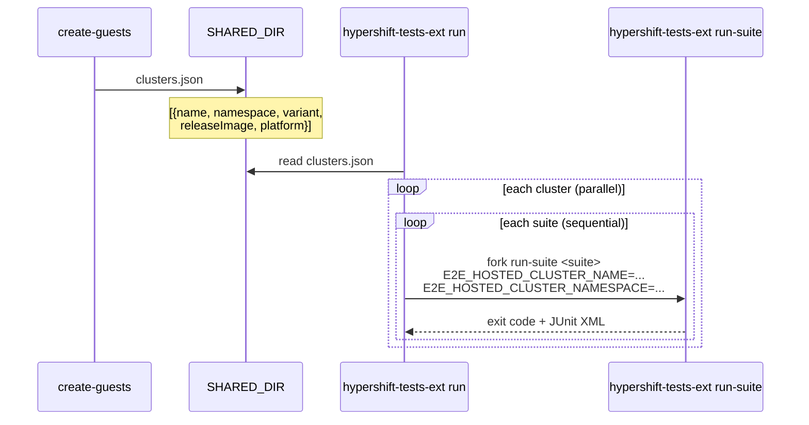

# hypershift-tests-ext

OTE ([OpenShift Tests Extension](https://github.com/openshift-eng/openshift-tests-extension)) binary for HyperShift v2 e2e tests. Provides test discovery, scheduling, and multi-cluster orchestration for CI.

## Build

```
make e2ev2-hypershift-tests-ext    # produces bin/hypershift-tests-ext
```

## Commands

| Command | Purpose |
|---------|---------|
| `list tests` | List registered test specs (OTE protocol) |
| `list suites` | List registered suites |
| `run-suite <name>` | Run a single suite via OTE scheduler |
| `run` | Orchestrate all suites across all clusters |

## CI pipeline



## Suites

Suite registration order determines sequential execution order per cluster.

| Suite | Qualifier | Parallelism |
|-------|-----------|-------------|
| `hypershift/conformance` | excludes `control-plane-upgrade` and `etcd-chaos` labels | default |
| `hypershift/upgrade` | `control-plane-upgrade` label | 1 |
| `hypershift/chaos` | `etcd-chaos` label | 1 |

## Test routing

The `run` command has zero knowledge of which tests belong on which clusters. Every suite runs against every cluster. Tests self-select via **skip guards** that inspect observable cluster properties:

| Test | Skip condition |
|------|---------------|
| Control plane upgrade | `hc.Spec.Release.Image == E2E_LATEST_RELEASE_IMAGE` (already on target) |
| Etcd chaos | `len(hc.Status.Version.History) < 2` (no upgrade occurred) |

Tests that find an incompatible cluster skip immediately, making the suite invocation a fast no-op.

## OTE features

### Taint label convention

Ginkgo `Label("taint:<name>")` decorators are automatically mapped to OTE isolation taints. OTE's scheduler serializes specs sharing a taint, preventing conflicts between tests that mutate shared resources.

```go
// In the test file:
var _ = Describe("...", Label("taint:nodepool-autoscaling"), func() { ... })

// Automatically becomes:
spec.Resources.Isolation.Taint = ["nodepool-autoscaling"]
```

### Cluster manifest

`create-guests` writes `SHARED_DIR/clusters.json` with structured cluster metadata (`lifecycle.ClusterManifest`). The `run` command deserializes this instead of parsing filenames.

```json
[
  {"name": "public-a1b2c3d4e5", "namespace": "clusters", "variant": "public", "releaseImage": "...", "platform": "aws"},
  {"name": "upgrade-a1b2c3d4e5", "namespace": "clusters", "variant": "upgrade", "releaseImage": "...", "platform": "aws"}
]
```

## Design principles

**Every suite runs against every cluster.** This catches topology-specific regressions that a single designated cluster would miss. Tests that don't apply to a given cluster skip via skip guards, so the cost is a fast no-op invocation. Adding a new cluster variant automatically gets full test coverage with zero routing changes. Do not "optimize" this by routing specific suites to specific clusters.

**The `run` command has no domain knowledge.** It does not know test names, cluster variant semantics, or which suites belong where. All selection logic lives in the tests themselves. Adding routing logic to the run command recreates the TestMatrix coupling this design replaced.

**Skip guards inspect observable cluster state, not labels or variant names.** A test decides whether to run by looking at the HostedCluster object (release image, version history, platform type), not by checking if the cluster is named "upgrade" or tagged with a marker. If a new skip condition is needed, the question is "what's different about the cluster?" not "what did we name it?"

**Suite order enables causal dependencies.** Suites run sequentially per cluster in registration order, so later suites can depend on state produced by earlier ones. For example, chaos tests check version history for evidence of an upgrade — if upgrade hasn't run first, they skip. New suites that depend on prior mutations should be appended after the suite that produces the state they need.

**OTE schedules within a cluster; `run` schedules across clusters.** OTE's resource pools, taints, and conflict resolution operate within a single `run-suite` invocation (one cluster). Multi-cluster parallelism is the `run` command's job. These are separate concerns that should not be mixed.

**Taints are declared at the test, never in orchestration code.** `Label("taint:foo")` in a Ginkgo `Describe` is the only way to set a taint. The mapping from labels to OTE taints is generic — no special-casing of individual tests.

## Signal handling

The `run` command intercepts SIGINT/SIGTERM and forwards SIGTERM to child `run-suite` processes, allowing OTE to flush JUnit output before exiting.

## Tests

```
go test -tags e2ev2 -v -count=1 ./test/e2e/v2/cmd/hypershift-tests-ext/
```

Requires the binary at `bin/hypershift-tests-ext` (build first with `make e2ev2-hypershift-tests-ext`).
